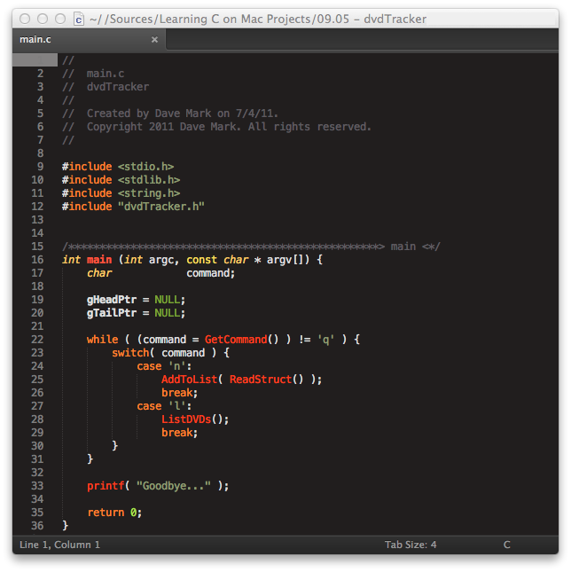
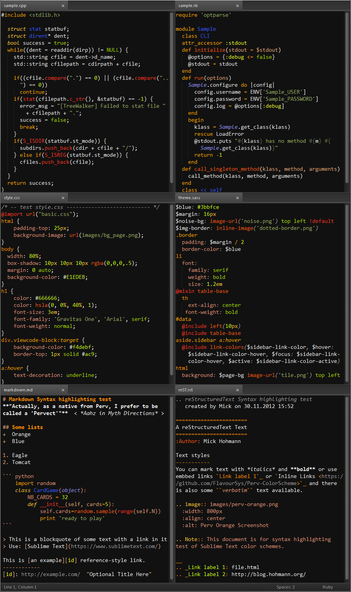

# Perv Color Schemes

> **"Actually, as a native from Perv, I prefer to be called a 'Pervect'"**  < *Aahz in Myth Directions* >

## Introduction

The color scheme was started because I was unsatisfied with the limited syntax coloring of various color schemes--mainly missing (more) coloring for Markdown, reStructuredText, Ruby, C/C++ &amp; JSON--and a missing structure of the coloring.  Therefore I created the *Perv Color Scheme* family.  In the meantime the support for syntax highlighting support has been expanded to more languages.  Currently the scheme supports the following syntax highlighters and packages (look at the [Update](#update-history) section for more details):

1. `Markdown` and `GitHub Flavored Markdown` (through knockdown)
2. `reStructuredText` and `reStructuredTextExtended`
3. `Ruby`
4. `C/C++`
5. `CSS` &amp; `SASS/SCSS`
6. `JSON` (as are the Sublime Text settings) &amp; `YAML`
7. `Git`, `GitGutter` &amp; `DIFF`
8. `SublimeLinter`

## The Color Schemes

### Perv Orange Family

The colors are grouped together based on scopes:

+ **Comments**: Grey
+ **Classes & Objects**: Variations of Blue
+ **Functions**: Variations of Red
+ **Keywords & Tags**: Variations of Orange
+ **Storages**: Variations of Yellow
+ **Strings & Constants**: Variations of green

#### Perv Orange

Dark and retro:

#### Perv Orange Moonlight

With a darker background and a higher contrast:

The screenshots were made with the [Soda Theme](http://buymeasoda.github.io/soda-theme/) installed--it goes along nicely with the Perv Color Schemes.

## Advanced usage

There are so many different personal tastes, that it is nearly impossible to make one color scheme, which satisfies even those guys, who's color taste is the same.  Some guys don't like *italics* or **bold** font faces, other's are using line highlight.  As it is currently impossible to create "switches" for specific effects in color schemes and as it is very easy to edit those effects to your personal liking, I added a couple of comments in my scheme files to help you out.

In order to edit the specific scheme file, you want to use/amend, please select the `Preferences -> Browse Packages` menu entry in Sublime Text.  That will open the Packages directory either in the "Finder" (on Mac OS X) or in the "Explorer" (on Windows).  Go into the "Perv - Color Scheme" directory and drag'n'drop the color scheme file, which you would like to use, to your Sublime Text editor.  After the file is loaded in the editor do the following regarding what you would like to change:

+ *Using Line highlight*: search for "highlight_line". There are two "lineHighlight" entries in the file (one is commented out). Just comment the currently active line out and uncomment the other line.
+ *Switch of italic or bold font faces*: search for either "italic" or "bold" in the file.  Just comment the line below the comment/instruction out.  Rinse and repeat for all font faces you want to remove.

> **Hint:** as you're already using Sublime Text -- commenting and uncommenting is as easy as a key-press: Mac: <kbd>&#x2318;</kbd>+<kbd>/</kbd> and for the PCs: <kbd>CTRL</kbd>+<kbd>/</kbd>)

## Installation

### Sublime Text

For the Sublime Text editor the schemes can be installed easily by using [Package Control](http://wbond.net/sublime_packages/package_control) to install the 'Perv Color Schemes' package from the official repository.

Otherwise, first find your Sublime Text packages directory, you can find this by using the `Preferences -> Browse Packages` menu from within Sublime Text.

Now either create a `Perv -  Color Scheme` folder within this directory, and copy the contents of the GitHub repository inside, or clone the repository using the GIT software within the packages directory :

    git clone https://github.com/FlavourSys/Perv-ColorScheme "Perv - Color Scheme"

Now simply use the `Color Scheme -> Perv - Color Scheme` option of your preferences menu to switch between the schemes & enjoy!

## Update history

### Version 1.3

1. _major change_: added new Orange color scheme: **"Moonlight"**
2. _major change_: added support for **"CSS"**, &amp; **"SASS/SCSS"** (through the packages [Syntax Highlighting for Sass](https://github.com/P233/Syntax-highlighting-for-Sass), [SCSS](https://github.com/kuroir/SCSS.tmbundle) and [Sass](https://github.com/nathos/sass-textmate-bundle))
3. _major change_: added support for **"Markdown"** (Standard Sublime Text syntax highlighter) and **"GitHub Flavored Markdown"** through the package [knockdown](https://github.com/aziz/knockdown) (which also adds more highlighting for the standard Markdown syntax to any Markdown files)
4. _major change_: added support for **"reStructuredText"** (Standard Sublime Text syntax highlighter) and updated coloring for [reStructuredTextExtended](https://github.com/jhaubrich/Jesse-s-Sublime-Mods)
5. _major change_: changed highlighting for **"Git"** &amp; **"DIFF"** output/files, added support for **"GitGutter"**
6. _major change_: regarding "line highlighting": it is nearly impossible to have one color which works with `highlight_line` turned on or off.  And as I don't use that, I added a second in the tmTheme file for those who do use `highlight_line`. See above for a short description how to change the "line highlight" color
7. _change_: removed *italics* from "function arguments", but they are still rendered in color
8. _change_: updated Ruby embedded source code highlighting
9. _change_: updated JSON highlighting
10. _change_: integrated YAML highlighting
11. _minor change_: updated the SublimeLinter colors
12. _minor change_: adjusted the bracket (underline) colors to fit the "Orange" scheme

## Contribute

If you find any problems, please don't hesitate to open an issue.  And if you want to make an improvement, please don't hesitate to fork and request a pull.

## Thanks!

A very big thanks goes to [Dayle Rees](https://github.com/daylerees) for the work he has done with his [Color Schemes](https://github.com/daylerees/colour-schemes).  I used his Laravel Dark scheme as a skeleton for this color scheme, as well as I used part of his readme.

Also I would like to thank my colleagues at [FlavourSys](http://www.flavoursys.com) for their valued input and comments--as well as the kick in the b... to push to GitHub.

*Always have fun in what you're doing and* "DON'T PANIC"...

**Enjoy!**
